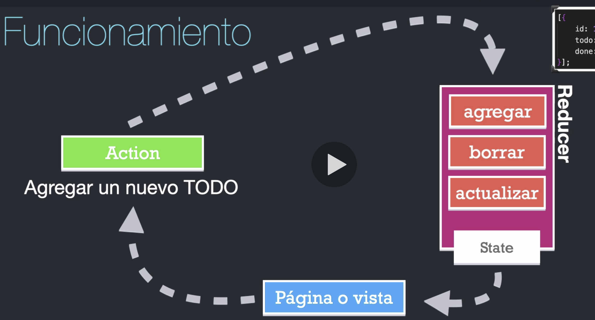

[Volver a inicio](../../README.md)
---

# 🔀 useReducer

## ¿Qué es un reducer?

Es una función pura

```javascript
const initialToDoItems = [
    {
        id: 1,
        toDo: "Terminar de leer este readme",
        done: false
    }
];

const todoReducer = (state = initialToDoItems, action) => {
    return state;
}
```

1. No debe tener efectos secundarios
2. No debe realizar tareas asincronas
3. Debe retornar siempre un nuevo estado
4. Usualmente recibe dos argumentos (initial state y action)
5. No debe de requerir más que una acción que puede tener un argumento

La idea es tener en un solo lugar todas las posibles modificaciones que mi app puede ejecutar sobre mi estado, conociendo con exactitud donde estan ubicadas estas acciones. Toda la información por ende, fluye en una sola vía, de una forma completamente controlada.



---

## useReducer en React JS

`const [state, dispatch] = useReducer(reducer, initialArg, init);`

`useReducer` a menudo es preferible a `useState` cuando se tiene una lógica compleja que involucra múltiples subvalores o cuando el próximo estado depende del anterior. `useReducer` además te permite optimizar el rendimiento para componentes que activan actualizaciones profundas, porque puedes pasar hacia abajo dispatch en lugar de callbacks.

```javascript
const initialState = {count: 0};

function reducer(state, action) {
  switch (action.type) {
    case 'increment':
      return {count: state.count + 1};
    case 'decrement':
      return {count: state.count - 1};
    default:
      throw new Error();
  }
}

function Counter() {
  const [state, dispatch] = useReducer(reducer, initialState);
  return (
    <>
      Count: {state.count}
      <button onClick={() => dispatch({type: 'decrement'})}>-</button>
      <button onClick={() => dispatch({type: 'increment'})}>+</button>
    </>
  );
}
```
---

### ⚠️ React garantiza que la identidad de la función dispatch es estable y no cambiará en subsecuentes renderizados. Es por eso que es seguro omitirla de la lista de dependencias de useEffect o useCallback.
---

### Inicialización diferida

También puedes crear el estado inicial de manera diferida. Para hacerlo, le puedes pasar una función init como tercer argumento. El estado inicial será establecido como init(initialArg).

```javascript
function init(initialCount) {
  return {count: initialCount};
}

function reducer(state, action) {
  switch (action.type) {
    case 'increment':
      return {count: state.count + 1};
    case 'decrement':
      return {count: state.count - 1};
    case 'reset':
      return init(action.payload);
    default:
      throw new Error();
  }
}

function Counter({initialCount}) {
  const [state, dispatch] = useReducer(reducer, initialCount, init);
  return (
    <>
      Count: {state.count}
      <button
        onClick={() => dispatch({type: 'reset', payload: initialCount})}>
        Reset
      </button>
      <button onClick={() => dispatch({type: 'decrement'})}>-</button>
      <button onClick={() => dispatch({type: 'increment'})}>+</button>
    </>
  );
}

```
---
## ¿Cómo evitar pasar callbacks hacia abajo?

Una alternativa que se recomienda es pasar una función dispatch desde useReducer a través del [contexto](../08-useContext/useContext.md) (Context): 

```javascript
const TodosDispatch = React.createContext(null);

function TodosApp() {
  // Nota: `dispatch` no cambia entre re-renderizados
  const [todos, dispatch] = useReducer(todosReducer);

  return (
    <TodosDispatch.Provider value={dispatch}>
      <DeepTree todos={todos} />
    </TodosDispatch.Provider>
  );
}

function DeepChild(props) {
  // Si queremos realizar una acción, podemos obtener dispatch del contexto.
  const dispatch = useContext(TodosDispatch);

  function handleClick() {
    dispatch({ type: 'add', text: 'hello' });
  }

  return (
    <button onClick={handleClick}>Add todo</button>
  );
}
```


---

## Ejemplo useReducer

```javascript
// <ToDoApp/>
import React, { useReducer, useEffect } from 'react'
import { toDoReducer } from './toDoReducer';
import { ToDoList } from './ToDoList';
import { ToDoAdd } from './ToDoAdd';

const init = () => {
    return JSON.parse(localStorage.getItem('toDos')) || [];
}

export const ToDoApp = () => {

    const [ toDos, dispatch ] = useReducer(toDoReducer, [], init);

    useEffect(() => {
        localStorage.setItem('toDos', JSON.stringify(toDos))
    }, [toDos])

    const handleDelete = (toDoID) => {
        dispatch({type: "delete", payload: toDoID});
    }

    const handleToggle = (toDoID) => {
        dispatch({type: 'toggle', payload: toDoID});
    }

    const handleAddToDo = (newToDo) => {
        dispatch({type: 'add', payload: newToDo})
    }

    return (
        <div>
            <h1>ToDo App ( {toDos.length} )</h1>
            <hr />
            <div className="row">
                <div className="col-7">
                    <ToDoList
                        toDos={toDos}
                        handleDelete={handleDelete}
                        handleToggle={handleToggle}
                    />
                </div>
                <div className="col-5">
                    <ToDoAdd 
                        handleAddToDo={handleAddToDo}
                    />
                </div>
            </div>
        </div>
    )
}

// <ToDoList/>
import React from 'react';
import { ToDoListItem } from './ToDoListItem';

export const ToDoList = ({toDos, handleDelete, handleToggle}) => {
    return (
        <>
            {toDos.map( (toDo, index) => (
                <ToDoListItem 
                    key={toDo.id}
                    handleDelete={handleDelete} 
                    handleToggle={handleToggle} 
                    toDo={toDo} 
                    index={index}
                />
            ))}
        </>
    )
}

// <ToDoListItem/>
import React from 'react';

export const ToDoListItem = ({toDo, index, handleDelete, handleToggle}) => {
    return (
        <li
            key={toDo.id}
            className="list-group-item"
        >
            <p className={toDo.done ? "complete" : ""} onClick={ () => handleToggle(toDo.id)} >{index + 1}. {toDo.desc}</p>
            <button className="btn btn-danger" onClick={() => handleDelete(toDo.id)}>
                Borrar
            </button>
        </li>
    )
}

// <ToDoAdd/>
import React from 'react'
import { useForm } from './hooks/useForm';

export const ToDoAdd = ({handleAddToDo}) => {

    const [ { description }, handleInputChange, reset] = useForm({
        description: ""
    });

    const handleSubmit = (e) => {
        e.preventDefault();

        if(description.trim().length <= 1) {
            return;
        }

        handleAddToDo({id: new Date().getTime(), desc: description, done: false});
        reset();
    }
    
    return (
        <>
            <h4>Agregar ToDos</h4>
            <hr />

            <form onSubmit={handleSubmit}>
                <input 
                    type="text"
                    name="description"
                    value={description}
                    className="form-control"
                    placeholder="Aprender..."
                    autoComplete="off"
                    onChange={handleInputChange}
                />
                <button className="btn btn-outline-primary mt-1 btn-block">
                    Agregar
                </button>
            </form> 
        </>
    )
}

```

# Pruebas


### toDoReducer
```javascript
// demoTodos
export const demoTodos = [{
    id: 1,
    desc: 'Aprender React',
    done: false
},
{
    id: 2,
    desc: 'Aprender Mongo',
    done: false
}]

import { toDoReducer } from "../../components/toDoReducer"
import { demoTodos } from "../fixtures/demoTodos";


describe('Pruebas en toDoReducer', () => {
    
    test('debe de retornar el estado por defecto', () => {
        const state = toDoReducer(demoTodos, {});

        expect(state).toEqual(demoTodos)

    })

    test('debe de agregar un TO DO', () => {
        const newToDo = {
            id: 3,
            desc: 'Aprender Angular',
            done: false
        };

        const action = {
            type: 'add', 
            payload: newToDo
        };

        const state = toDoReducer(demoTodos, action);

        expect(state.length).toBe(3);
        expect(state).toEqual([...demoTodos, newToDo])
    })

    test('debe de borrar el TO DO', () => {
        const action = {type: 'delete', payload: 1};

        const state = toDoReducer(demoTodos, action);
        expect(state.length).toBe(1);
        expect(state).toEqual([ demoTodos[1]]);
    })

    test('debe de hacer el toggle del TO DO', () => {
        const action = {type: 'toggle', payload: 2};

        const state = toDoReducer(demoTodos, action);
        expect(state.length).toBe(2);
        expect(state[1].done).toBe(true);
        expect(state[0]).toEqual(demoTodos[0])
    })
    
})

```

---

### ToDoApp
```javascript
import React from 'react'
import { mount, shallow } from 'enzyme'

import { ToDoApp } from '../../components/ToDoApp'
import { demoTodos } from '../fixtures/demoTodos';
import { act } from '@testing-library/react';


describe('Pruebas sobre <ToDoApp/>', () => {
    
    const wrapper = shallow(
        <ToDoApp/>
    );

    Storage.prototype.setItem = jest.fn(()=>{})

    test('debe de mostrarse correctamente', () => {
        expect(wrapper).toMatchSnapshot();
    })

    test('debe de agregar un TO DO', () => {
        
        const wrapper = mount(<ToDoApp/>);

        act( () => {
            wrapper.find('ToDoAdd').prop('handleAddToDo')( demoTodos[0] );
            wrapper.find('ToDoAdd').prop('handleAddToDo')( demoTodos[1] );
        })

        expect(wrapper.find('h1').text().trim()).toBe('ToDo App ( 2 )')
        expect(localStorage.setItem).toHaveBeenCalledTimes(2)

    })
    
    test('debe de eliminar un TO DO', () => {
        wrapper.find('ToDoAdd').prop('handleAddToDo')( demoTodos[0] )
        wrapper.find('ToDoList').prop('handleDelete')( demoTodos[0].id )
        expect(wrapper.find('h1').text().trim()).toBe('ToDo App ( 0 )')
    })
    
    

})

```

---
### ToDoList

```javascript
import React from 'react'
import {shallow} from 'enzyme'

import { ToDoList } from '../../components/ToDoList'
import { demoTodos } from '../fixtures/demoTodos'


describe('Pruebas en <ToDoList/>', () => {

    const handleDelete = jest.fn();
    const handleToggle = jest.fn();
        
    const wrapper = shallow(
        <ToDoList
            toDos={ demoTodos }
            handleDelete={handleDelete}
            handleToggle={handleToggle}
        />
    )
    
    test('debe de mostrarse correctamente ', () => {

       expect(wrapper).toMatchSnapshot()

    })

    test('debe tener 2 <ToDoListItem />', () => {

        expect(wrapper.find('ToDoListItem').length).toBe(demoTodos.length);

        expect(wrapper.find('ToDoListItem').at(0).prop('handleDelete')).toEqual(expect.any(Function))
 
     })
    

})

```

---
### ToDoListItem

```javascript
import {shallow} from 'enzyme'
import React from 'react'
import { ToDoListItem } from '../../components/ToDoListItem'
import { demoTodos } from '../fixtures/demoTodos'


describe('Pruebas en ,ToDoListItem/>', () => {

    const handleDelete = jest.fn();
    const handleToggle = jest.fn();

    const wrapper = shallow(
        <ToDoListItem
            toDo={demoTodos[0]}
            index={0}
            handleDelete={handleDelete}
            handleToggle={handleToggle}
        />
    )
    
    test('debe de mostrarse correctamente ', () => {                
        expect(wrapper).toMatchSnapshot();
    })

    test('debe de llamar la función borrar', () => {
        
        wrapper.find('button').simulate('click');
        expect(handleDelete).toHaveBeenCalledWith(demoTodos[0].id)

    })
    
    test('debe de llamar la función toggle', () => {

        wrapper.find('p').simulate('click');
        expect(handleToggle).toHaveBeenCalledWith(demoTodos[0].id)
    })

    test('debe de mostrar el texto correctamente', () => {
        const p = wrapper.find('p');
        expect(p.text().trim()).toBe(`1. ${demoTodos[0].desc}`)
    })
    
    test('debe de tener la clase complete si el TO DO esta hecho', () => {
        const todo = demoTodos[0];
        todo.done = true;

        const wrapper = shallow(
            <ToDoListItem
                toDo={todo}
                index={0}
                handleDelete={handleDelete}
                handleToggle={handleToggle}
            />
        )

        expect(wrapper.find('p').hasClass('complete')).toBe(true)
    })
    

})

```

### ToDoAdd

```javascript
import React from 'react'
import {shallow} from 'enzyme'
import { ToDoAdd } from '../../components/ToDoAdd'


describe('Pruebas sobre <ToDoAdd/>', () => {

    const handleAddToDo = jest.fn()

    const wrapper = shallow(
        <ToDoAdd
            handleAddToDo={handleAddToDo}
        />
    )
    
    test('debe de mostrarse correctamente ', () => {
        expect(wrapper).toMatchSnapshot()
    })

    test('NO debe de llamar handleAddToDo', () => {
        
        const formSubmit = wrapper.find('form').prop('onSubmit');

        formSubmit({ preventDefault(){}});

        expect(handleAddToDo).toHaveBeenCalledTimes(0);
    })

    test('debe de llamar la funcion handleAddToDo', () => {
        const value = 'Aprender react';

        wrapper.find('input').simulate('change', {
            target: {
                value,
                name: 'description'
            }
        })

        const formSubmit = wrapper.find('form').prop('onSubmit');

        formSubmit({ preventDefault(){}});

        expect(handleAddToDo).toHaveBeenCalledTimes(1);
        expect(handleAddToDo).toHaveBeenCalledWith(expect.any(Object));
        expect(handleAddToDo).toHaveBeenCalledWith({
            id: expect.any(Number),
            desc: value,
            done: false
        });

        expect(wrapper.find('input').prop('value')).toBe('')

    })
    
})

```

---
[ir a ⬇️ useContext](../08-useContext/useContext.md)
